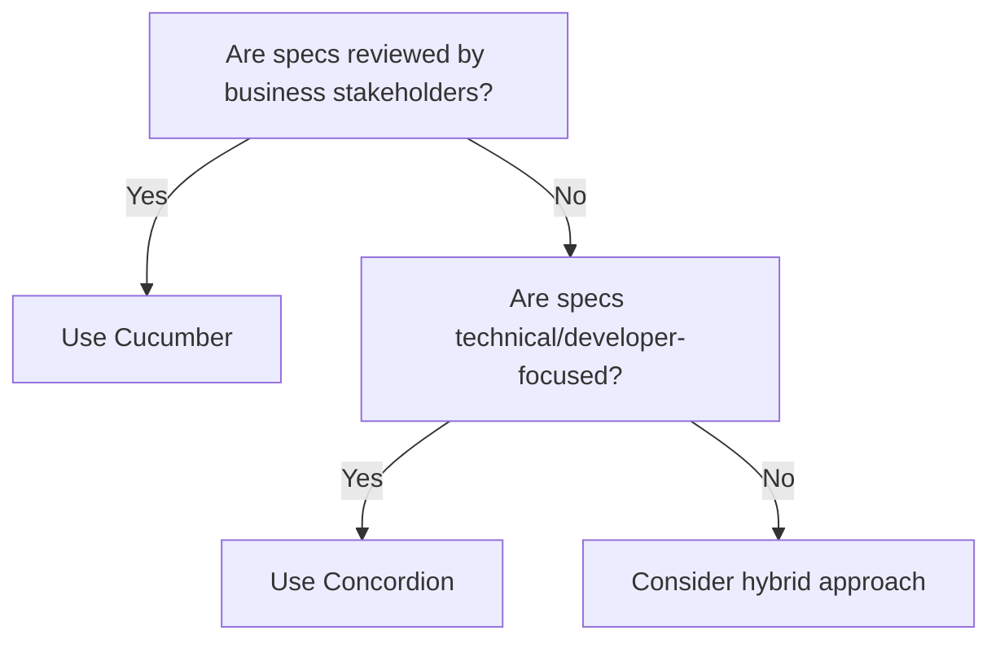

# **Choosing Between Concordion and Cucumber for Specification by Example**  
**A Guide to Selecting the Right Tool for Executable Specifications**  

---

## **1. Introduction: The Role of Specification by Example (SBE)**  
Specification by Example (SBE) bridges the gap between business requirements and automated tests by:  
- **Expressing requirements as executable examples** (e.g., Gherkin scenarios).  
- **Ensuring alignment** between developers, testers, and stakeholders.  
- **Creating living documentation** that stays up-to-date with the code.  

Two leading tools for SBE are **Cucumber** (Gherkin-based) and **Concordion** (HTML-based).  
This section details **when to use each** based on project needs.  

---

## **2. Key Differences Between Concordion and Cucumber**  

| Feature                | **Cucumber**                          | **Concordion**                        |  
|------------------------|--------------------------------------|--------------------------------------|  
| **Syntax**             | Gherkin (`Given/When/Then`)          | HTML/Markdown with embedded assertions |  
| **Audience**           | Non-technical stakeholders            | Technical stakeholders               |  
| **Test Execution**     | Step definitions map to code          | Inline assertions in HTML docs        |  
| **Reporting**          | Standard Cucumber reports             | Self-documenting HTML outputs        |  
| **Flexibility**        | Strict structure (Gherkin-only)       | Free-form (mix prose + tests)        |  
| **Best For**           | Collaboration with business teams     | Detailed technical documentation     |  

---

## **3. When to Use Cucumber**  

### **✅ Ideal Use Cases**  
1. **Collaboration with Non-Technical Stakeholders**  
   - Business analysts/product owners can **read and contribute** to Gherkin scenarios.  
   - Example:  
     ```gherkin  
     Scenario: Account withdrawal  
       Given an account balance of $100  
       When the user withdraws $20  
       Then the new balance should be $80  
     ```  

2. **BDD (Behavior-Driven Development) Workflows**  
   - Teams practicing BDD benefit from Cucumber’s **ubiquitous language**.  

3. **Integration Testing**  
   - End-to-end tests (e.g., UI/API flows) where **high-level behavior matters more than implementation details**.  

### **❌ When to Avoid Cucumber**  
- **Overly technical specifications** (e.g., testing algorithms).  
- **Teams without stakeholder buy-in** (Gherkin becomes "just another test script").  

---

## **4. When to Use Concordion**  

### **✅ Ideal Use Cases**  
1. **Detailed Technical Documentation**  
   - Combines **human-readable prose** with **inline assertions**.  
   - Example (HTML):  
     ```html  
     <p>If a <span concordion:set="#balance">100</span> USD account withdraws  
        <span concordion:set="#amount">20</span> USD,  
        the new balance should be <span concordion:assert-equals="#balance - #amount">80</span> USD.</p>  
     ```  

2. **Data-Driven Testing**  
   - Easily embed **tables, examples, and dynamic inputs** in documentation.  

3. **API or Library Documentation**  
   - Ideal for **developer-facing specs** (e.g., "How to use this SDK").  

### **❌ When to Avoid Concordion**  
- **Non-technical audiences** (HTML/Markdown may intimidate business users).  
- **Teams needing standardized Gherkin** (e.g., if QA already uses Cucumber).  

---

## **5. Decision Flowchart: Cucumber vs. Concordion**  



---

## **6. Hybrid Approach: Combining Both Tools**  
Some teams use **Cucumber for high-level acceptance tests** and **Concordion for detailed technical specs**.  

**Example Workflow:**  
1. **Cucumber**: Define user journeys (`Account withdrawal`).  
2. **Concordion**: Document edge cases (`Interest calculation formulas`).  

---

## **7. Key Takeaways**  
| **Tool**     | **Strengths**                          | **Weaknesses**                     |  
|--------------|---------------------------------------|-----------------------------------|  
| **Cucumber** | Best for collaboration, BDD           | Rigid syntax; can be overkill     |  
| **Concordion** | Ideal for technical docs, flexibility | Less accessible to non-devs       |  

**Recommendation**:  
- Start with **Cucumber** if business alignment is critical.  
- Use **Concordion** for developer-centric or data-heavy specs.  

