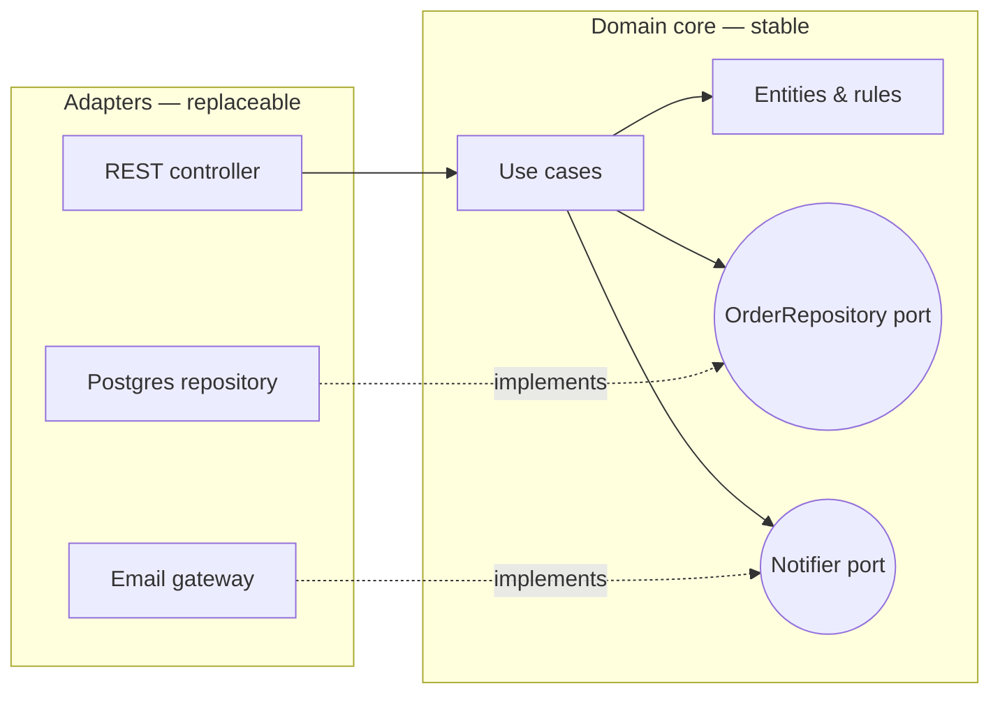
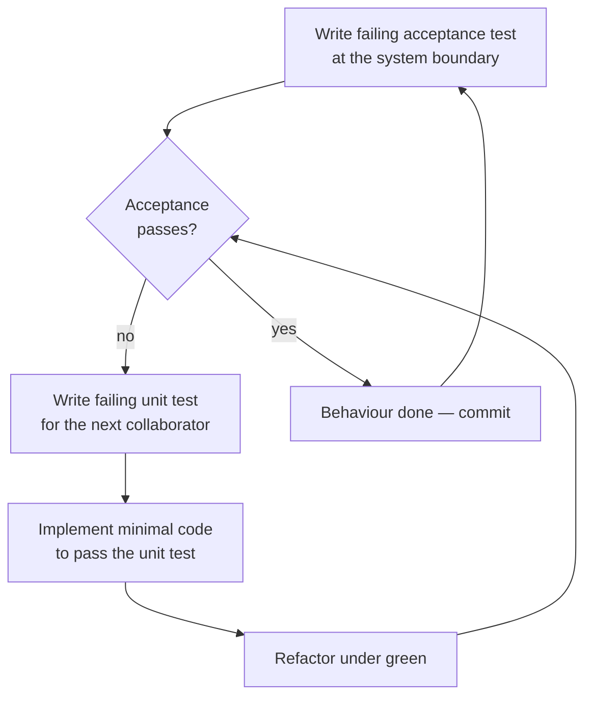
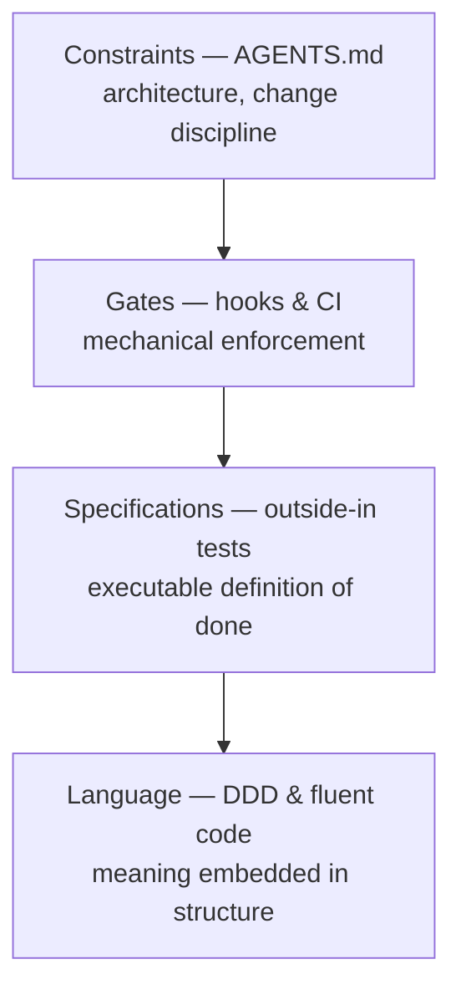

# Engineering for Determinism: Reducing LLM Context Overload Through Disciplined Software Practices

*A white paper for software engineers and test engineers working with LLM coding agents*

---

## 1. The Problem: Context Overload and Non-Determinism

If you have used an LLM coding agent for more than a fortnight, you have seen the failure modes. They are not exotic. The agent invents a repository pattern your codebase doesn't use. It writes tests in a style abandoned two years ago because that style still dominates the older half of the test suite. It produces a 900-line diff for what should have been a 40-line change. Asked to do the same task twice, it produces two structurally different solutions. And the longer a session runs, the worse it gets.

These failures share a root cause: **the agent's behaviour is a function of its context, and its context is a lossy, noisy, expensive approximation of your project's actual rules.**

### Why large, unstructured context degrades output

Three practical effects matter to a working engineer:

**Lost-in-the-middle.** When an agent loads tens of thousands of tokens of source code, the material in the middle of that window has measurably less influence on its output than material at the start or end. You will observe this as the agent "forgetting" a convention it read twenty files ago — not because it never saw it, but because attention over long contexts is uneven. The convention was there; it just didn't win.

**Conflicting signals.** Real codebases contain their own history. The old service layer uses exceptions; the new one uses result types. Half the tests mock the database; the newer half use an in-memory fake. An agent that infers conventions by reading code is sampling from a distribution that includes every era of your project. When it picks the wrong era, that isn't a hallucination — it is faithful imitation of the wrong example. You will observe this as *inconsistency between runs*: which era wins depends on which files happened to be loaded.

**Stale and irrelevant examples.** Every file the agent loads that isn't relevant to the task dilutes the files that are. Context is not free attention; it is a budget. Spending it on a 2,000-line legacy module so the agent can find one interface signature is like requiring a new starter to read the whole wiki before fixing a typo.

### The cost of non-determinism for teams

Non-determinism is not merely aesthetic. It has concrete costs:

- **Unreviewable diffs.** When each agent run has a different "style opinion", reviewers cannot pattern-match. Review time scales with surprise, and non-deterministic output is maximally surprising.
- **Inconsistent styles compound.** Every inconsistent merge becomes training data for the next agent session that reads it. Drift is self-reinforcing.
- **Regressions.** An agent that holds the whole system loosely in a degraded context will confidently modify behaviour it doesn't understand. Without mechanical guardrails, nothing stops that change reaching a branch.
- **Retry churn.** Teams quietly absorb the cost of running the agent three times and picking the best result. That is a determinism tax paid in wall-clock time and money.

### The reframe: move knowledge from context into constraints

The thesis of this paper is simple:

> Knowledge that lives in **context** must be loaded on every session, competes for attention, decays with distance, and is interpreted probabilistically. Knowledge that lives in **constraints** — architecture rules, hooks, executable tests, and a shared language embedded in the code itself — is enforced mechanically, costs near-zero tokens, and behaves identically every time.

Every practice in this paper is a transfer along that axis. None of them were invented for AI; they are the same disciplines that make codebases maintainable for humans. That is not a coincidence. A human joining your team and an agent starting a session face the same problem: reconstructing your project's rules from limited attention. Teams that solved this for people already solved most of it for agents.

Determinism is engineered, not prompted.

> **For testers:** Treat agent non-determinism as a testability defect, not an AI quirk. If two runs of the same task produce structurally different code, your project lacks enforced constraints — the same gap that lets *human* variance through. Everything that follows is as much a QA architecture as a development one.

---

## 2. AGENTS.md as an Architectural Contract

Most teams' first instinct is to write prompts: "please follow our conventions", pasted into every session. This fails for the reasons above — prose instructions compete with thousands of lines of contradictory code evidence, and they decay in long sessions.

The better model is a **contract file** — `AGENTS.md` (or `CLAUDE.md`, or equivalent) at the repository root — that encodes a small number of *non-negotiable, checkable* rules. The word *contract* is deliberate: it is short, it is stable, it is versioned with the code, and violations are findable in review. It is the single document the agent loads at the start of every session, so every line in it must earn its tokens.

Three families of rules give the highest return.

### 2.1 Hexagonal architecture: a small, stable surface to reason about

Hexagonal (ports and adapters) architecture puts the domain core at the centre, defines its needs as **ports** (interfaces owned by the domain), and implements those ports with **adapters** at the edge. Dependencies point inward only.



Why does this matter for an agent specifically?

**It bounds what must be loaded.** "Switch order notifications from SMTP to a webhook" is, in a hexagonal codebase, an *adapter task*: the agent needs the `Notifier` port (perhaps 15 lines), the existing adapter, and its test. It does not need the domain model, the other adapters, or the wiring of the whole system. The port *is* the context — a complete, authoritative specification of the boundary, usually smaller than a single legacy method.

**It makes the stable part stable.** The domain core changes for business reasons only. That means the most important knowledge in the system — the rules — sits in a small set of files that rarely churn, so what the agent learned about them last month is still true. In a tangled architecture, *everything* churns, and the agent's priors are always slightly wrong.

**It converts architecture violations into detectable events.** "Domain must not import infrastructure" is a rule a linter can enforce (`dependency-cruiser`, ArchUnit, NetArchTest). Once enforced, it no longer needs to be *remembered* — which is the subject of Section 3.

### 2.2 Documentation update rules: self-refreshing context

An agent's future context is only as good as your docs. The contract therefore includes a coupling rule: **any change to public behaviour updates the relevant doc or ADR in the same change set.** Not "documentation should be kept up to date" — a wish — but a mechanical pairing: touch `src/billing/**` publicly, touch `docs/billing.md` or explain why not.

This turns documentation from a decaying asset into a self-refreshing one. Each agent session that changes behaviour repairs the very context the next session will load. Stale docs are worse than no docs for an agent: it will follow them confidently.

### 2.3 Rollback discipline: bounding the blast radius

Agents make mistakes; the question is whether mistakes are cheap. The contract encodes revertibility:

- **Small, single-purpose commits.** One logical change per commit; a revert is one command, not an archaeology project.
- **Feature flags for behaviour changes.** New behaviour ships dark; rollback is a config change, not a deploy.
- **Expand–contract migrations.** Schema changes go: add the new column → dual-write → migrate readers → remove the old column, each step independently deployable and reversible. Never a one-shot destructive migration.

This is risk engineering: it doesn't make the agent smarter, it makes the *cost of the agent being wrong* small and constant. That, in turn, changes team behaviour — you can grant an agent more autonomy when every action is undoable.

### 2.4 A realistic AGENTS.md excerpt

```markdown
# AGENTS.md — contract for automated contributors

## Architecture (enforced by dependency-cruiser; CI fails on violation)
- Hexagonal. Domain code lives in src/domain and src/application.
  It imports NOTHING from src/adapters, node_modules I/O libraries,
  or framework code. Dependencies point inward.
- New external capability = new port (interface) in src/application/ports
  + adapter in src/adapters. Never call infrastructure from a use case.
- To change an integration, modify the adapter. Do not touch the port
  unless the *domain's needs* changed.

## Change discipline
- One logical change per commit. Conventional Commits (enforced by hook).
- Behaviour changes ship behind a flag in src/config/flags.ts, default OFF.
- DB migrations follow expand–contract. Destructive steps are separate
  PRs, merged only after readers are migrated.
- If you change public behaviour, update the matching file under docs/
  in the same PR. ADRs live in docs/adr/; supersede, don't edit history.

## Definition of done
- A failing test existed before the implementation (see docs/tdd.md).
- `npm run verify` passes locally (lint, archtest, unit, acceptance).
- Diff under ~300 lines unless the task explicitly says otherwise;
  if it grows past that, stop and split.

## Do not
- Do not introduce new libraries without an ADR.
- Do not "improve" code outside the task's scope; note it in TODO.md.
- Do not disable, skip, or weaken a test to make it pass.
```

Around sixty lines. An agent can hold all of it, at full attention, for an entire session.

### 2.5 The context-reduction payoff

Without the contract, the agent must *infer* your architecture by reading code — thousands of tokens, sampled unevenly, interpreted probabilistically, different every run. With it, the agent reads one short document that states the rules outright, and the codebase merely provides examples. Inference becomes lookup. You will observe the difference directly: smaller diffs, fewer invented patterns, and — because every session starts from the same sixty lines — far more consistency *between* sessions.

> **For testers:** AGENTS.md is a testable artefact. Turn its architecture rules into executable checks (dependency-cruiser, ArchUnit) and its process rules into CI gates. A contract clause that nothing verifies is a prompt wearing a contract's clothes — audit the file periodically and delete or automate anything unenforced.

---

## 3. Pre-Commit Hooks as Deterministic Guardrails

A rule in AGENTS.md is read; a rule in a hook is *enforced*. The distinction is the whole point of this section.

Consider commit messages. You can instruct an agent: "use Conventional Commits, imperative mood, scope from the module name". That instruction costs tokens in every session, competes with everything else in context, and fails silently some percentage of the time. Or you can install `commitlint` in a `commit-msg` hook, and the instruction becomes unnecessary — a malformed message is rejected mechanically, with an error the agent reads and corrects in the same loop, identically, every time, forever.

**Anything a hook enforces is something the LLM no longer needs to be told, needs to remember, or needs a human to review.** That sentence is the highest-leverage idea in this paper. Each mechanised rule is a permanent transfer from the context budget (paid every session, probabilistic) to the toolchain (paid once, deterministic).

### 3.1 What belongs in hooks

- **Formatting** (Prettier, `dotnet format`, gofmt): eliminates the entire category of style drift. The agent can format however it likes; the hook normalises it. Reviewers never see whitespace diffs again.
- **Linting**, including architectural linting: unused imports, banned APIs, complexity ceilings, and — crucially — the dependency-direction rules from Section 2, so "domain must not import infrastructure" is physically uncommittable.
- **Commit message linting** (commitlint + Conventional Commits): machine-parseable history.
- **Secrets scanning** (gitleaks): agents paste credentials into examples with depressing regularity; this is non-negotiable.
- **Fast targeted tests** on staged files, where the suite allows.

### 3.2 A sample configuration

Using [Lefthook](https://github.com/evilmartians/lefthook) (the same shape works with Husky or pre-commit):

```yaml
# lefthook.yml
pre-commit:
  parallel: true
  commands:
    format:
      glob: "*.{ts,tsx,json,md}"
      run: npx prettier --write {staged_files} && git add {staged_files}
    lint:
      glob: "*.{ts,tsx}"
      run: npx eslint --max-warnings 0 {staged_files}
    arch:
      run: npx depcruise src --config .dependency-cruiser.cjs
    secrets:
      run: gitleaks protect --staged --redact

commit-msg:
  commands:
    lint-message:
      run: npx commitlint --edit {1}
```

```js
// commitlint.config.cjs
module.exports = {
  extends: ['@commitlint/config-conventional'],
  rules: {
    'scope-enum': [2, 'always',
      ['billing', 'catalog', 'shipping', 'identity', 'infra', 'docs']],
    'subject-max-length': [2, 'always', 72],
  },
};
```

Note the `scope-enum`: the allowed scopes are your bounded contexts (Section 5). The hook is now teaching the agent your domain map, one rejection at a time.

Two operational rules make this stick. First, **hooks and CI must run the same checks** — the hook is the fast local feedback loop, CI is the authority that catches `--no-verify`. Second, **keep hooks under a few seconds** by scoping to staged files; a slow hook is a bypassed hook, for humans and agents alike.

### 3.3 The self-correcting loop

Watch what happens when an agent trips a hook: the commit fails, the error message enters the agent's context — precisely targeted, at the moment of relevance, at the *end* of the window where attention is strongest — and the agent fixes it. This is the cheapest, most reliable form of agent steering that exists: feedback that is automatic, instant, specific, and identical on every violation. Compare that with a human reviewer noticing the same problem forty minutes later and typing a comment.

### 3.4 Deterministic history is future context

There is a second-order payoff. A history of small, conventionally-formatted, single-purpose commits is itself high-quality context:

- `git log --oneline -- src/adapters/payment/` gives an agent the *story* of a module in a few hundred tokens — often more useful than the code itself.
- `feat(billing): apply coupon at checkout` is semantically searchable; "assorted fixes" is noise.
- Small commits make `git bisect` viable, for agents as well as humans: a regression hunt becomes a binary search an agent can run mechanically instead of a whole-codebase read.

Noisy history is context overload deferred to your future self. Clean history is pre-compressed context.

> **For testers:** Hooks are the innermost quality gate — shift-left taken to its logical end, before code even reaches the repository. Own the hook and CI configuration as test infrastructure: verify hooks and CI are check-identical, monitor bypass rates (`--no-verify` followed by CI failure is your signal), and treat every recurring review comment as a candidate for mechanisation. A review comment written twice is a missing lint rule.

---

## 4. Outside-In TDD as the Steering Wheel

Constraints and gates say what the agent *must not* do. Tests say what it *must* do — and they say it in the only language that is genuinely unambiguous to an agent: an executable check with a binary outcome.

### 4.1 Double-loop TDD, briefly

Outside-in ("London school") TDD runs two nested loops:



The outer loop is a failing **acceptance test** at the boundary (HTTP endpoint, use-case port, CLI) describing one behaviour in business terms. It stays red while the inner loop runs: for each collaborator the design needs, write a failing **unit test**, implement minimally, refactor. When the outer test goes green, the behaviour is done — not "probably done": *done, by definition*.

### 4.2 Requirements as executable specifications

For agent work, the reframe is this: **requirements arrive as tests, not prose.** Prose is where ambiguity lives. "Apply the discount when the coupon is valid" leaves open a dozen questions — expired coupons? stacking? rounding? — and an agent will *answer them all, silently, differently each run*. That is where non-determinism comes from: not model temperature, but under-specification filled by sampling.

A failing test is a specification with no room for interpretation, and it doubles as the definition of done. The agent's task collapses from "understand what's wanted, infer the conventions, decide when finished" to "make this red thing green without breaking the other green things." The stop condition is external and binary — which also kills the familiar failure where an agent keeps "improving" code past the point of usefulness.

### 4.3 The safety net that makes refactoring continuous

Agents are strong refactorers *mechanically* and weak ones *semantically* — they will confidently apply a transformation that isn't behaviour-preserving. A dense test suite converts that risk from silent to loud: the refactor either stays green or fails immediately, in-loop, while the agent can still react. Teams with real coverage can let an agent refactor continuously; teams without it are right to be afraid.

### 4.4 How outside-in ordering limits context

The inner loop is a context-limiting device. At any moment the agent holds: one red test, the object under test, and the *interfaces* (not implementations) of its immediate collaborators — because outside-in style mocks or fakes them. It never needs the whole feature in its head; the outer acceptance test holds the big picture *for* it, mechanically, in the test runner. The feature is traversed one small, verifiable increment at a time — exactly the working set an attention-limited system handles best. (The same is true of human working memory, which is why this discipline predates LLMs by twenty years.)

### 4.5 A worked example

**Outer loop — the acceptance test** (at the use-case port, infrastructure faked):

```typescript
// acceptance/apply-coupon.spec.ts
it('applies a percentage coupon to an open order', async () => {
  const orders = new InMemoryOrderRepository();
  await orders.save(anOrder({ id: 'o-1', totalCents: 10_000 }));
  const coupons = new InMemoryCouponDirectory([
    aCoupon({ code: 'SPRING10', percentOff: 10 }),
  ]);

  const checkout = new CheckoutService(orders, coupons);
  const result = await checkout.applyCoupon('o-1', 'SPRING10');

  expect(result.totalCents).toBe(9_000);
});
```

Red. The inner loop asks: what does `CheckoutService` need? A design decision emerges — the *order* should own discount arithmetic. So:

**Inner loop — collaborator test:**

```typescript
// domain/order.spec.ts
it('reduces its total by the coupon percentage, rounding half up', () => {
  const order = anOrder({ totalCents: 10_005 });
  order.applyDiscount(aCoupon({ percentOff: 10 }));
  expect(order.totalCents).toBe(9_005); // 1000.5 → 1001 off
});

it('rejects a discount on a settled order', () => {
  const order = anOrder({ status: 'SETTLED' });
  expect(() => order.applyDiscount(aCoupon({ percentOff: 10 })))
    .toThrow(OrderAlreadySettled);
});
```

Note what just happened: the rounding rule and the settled-order rule — precisely the ambiguities prose would have left to chance — became explicit, reviewable decisions *before* implementation.

**Implementation — the minimum to go green:**

```typescript
// domain/order.ts
applyDiscount(coupon: Coupon): void {
  if (this.status === 'SETTLED') throw new OrderAlreadySettled(this.id);
  this._totalCents -= Math.round(this._totalCents * coupon.percentOff / 100);
}
```

Wire `CheckoutService` to load, delegate, and save; the outer test goes green; commit (`feat(billing): apply percentage coupon at checkout`). Total context in play at any step: well under a hundred lines.

> **For testers:** This is the section that changes your job most. In agent-driven development the highest-value activity is writing the *outer-loop tests* — turning requirements into executable acceptance specifications before the agent starts. You stop being the inspector at the end of the line and become the author of the definition of done. Guard one rule fiercely, with tooling where possible: tests are written before implementation, and the agent may never weaken a test to pass it.

---

## 5. Fluent Code, Ubiquitous Language, and DDD

The final layer is the code itself. Every identifier is context the agent loads for free — or noise it must compensate for. Domain-Driven Design is, among other things, a compression scheme.

### 5.1 The ubiquitous language

DDD's core discipline is a **ubiquitous language**: one vocabulary, agreed with the domain experts, used *identically* in conversation, code, tests, docs, and commit messages. If the business says "settle an invoice", the method is `invoice.settle()`, the test says `it('cannot settle a disputed invoice')`, and the commit says `feat(billing): settle invoice on payment capture`.

For an agent this alignment is worth more than any prompt. When the task description, the AGENTS.md scopes, the test names, and the code all use the same words, the agent's retrieval and generation snap to the same track — the task "prevent settling disputed invoices" *lexically matches* the exact files and tests that matter. Every synonym in the stack ("settle" in conversation, `close()` in code, "finalise" in docs) is a translation the agent must perform probabilistically, and translations are where inference errors breed.

### 5.2 Fluent code as token compression

Compare what a reader — human or agent — must infer:

**Before (anemic model, generic naming):**

```typescript
// order_manager.ts
export class OrderManager {
  async process(data: OrderData, flag: number, extra?: any): Promise<boolean> {
    if (data.st === 2 || data.st === 5) return false;
    const c = await this.db.query('SELECT * FROM coupons WHERE code = $1', [extra?.c]);
    if (c.rows.length && c.rows[0].exp > Date.now() && flag !== 1) {
      data.tot = data.tot - Math.floor(data.tot * c.rows[0].pct / 100);
      await this.db.query('UPDATE orders SET tot = $1 WHERE id = $2', [data.tot, data.id]);
      return true;
    }
    return false;
  }
}
```

To modify this safely, an agent must reconstruct: what states 2 and 5 mean, what `flag !== 1` guards, the coupon table schema, whether `Math.floor` is a rounding *decision* or an accident, and what `true`/`false` signify to callers. None of that is written anywhere — it must be inferred from usage across the codebase, which means loading callers, schema and history into context and *guessing*. Different sessions will guess differently. This single method is a context-overload generator.

**After (fluent, domain language):**

```typescript
// domain/order.ts
export class Order {
  applyDiscount(coupon: Coupon): void {
    this.ensureOpen();               // throws OrderAlreadySettled / OrderCancelled
    coupon.ensureRedeemable();       // throws CouponExpired / CouponExhausted
    this.total = this.total.reducedByPercent(coupon.percentOff); // Money rounds half-up
    this.record(new DiscountApplied(this.id, coupon.code));
  }
}
```

`order.applyDiscount(coupon)` now carries, in five words, what previously needed comments, docs, a schema and tribal knowledge: who owns the rule (the order), what can go wrong (named exceptions), where rounding lives (the `Money` type), and what the outside world learns (a domain event). The knowledge hasn't disappeared — it has moved from *context the agent must assemble* into *structure the agent cannot avoid*. Intention-revealing code is pre-paid inference.

### 5.3 Bounded contexts map to agent tasks

DDD's larger structure — **bounded contexts** — partitions the system into regions where the language is internally consistent: `billing`, `catalog`, `shipping`, each with its own model of concepts like "product" or "customer", integrated through explicit contracts (published events, translation layers) rather than shared classes.

The mapping to agent work is direct: **a bounded context is a natural unit of loadable context.** It is a self-contained vocabulary and rule set, typically a directory the agent can load *in isolation* and reason about *completely* — small enough to fit, closed enough that nothing essential lives outside it. A task scoped to one context ("in `billing`, add proration on plan change") needs the billing model and billing's inbound contracts, and nothing else. Aggregates play the same role one level down: an aggregate is a consistency boundary, which for an agent means *the largest thing it must fully understand to make a safe change* — deliberately kept small.

This is why the commitlint `scope-enum` in Section 3 listed bounded contexts, and why AGENTS.md names them: the whole stack shares one map.

> **For testers:** Write test names in the ubiquitous language and treat drift as a defect — `it('cannot settle a disputed invoice')`, never `it('returns false when status is 5')`. Well-named tests double as the behavioural documentation agents load first; a suite in domain language is an executable glossary. In review, flag new synonyms the way you would flag a failing assertion.

---

## 6. Synthesis: The Determinism Stack

The four practices are layers of one system, each converting a category of context into a category of constraint:



### An agent task flowing through the stack

Task: *"In billing, expired coupons should be rejected with a clear error."*

1. **Constraints.** The agent loads AGENTS.md (~60 lines): hexagonal rules, TDD required, flags, scopes. *Saved: inferring architecture and process from the codebase — the largest and least reliable inference of all.*
2. **Language.** "Billing" and "coupon" name a bounded context and an aggregate; the agent loads `src/domain/billing` and its tests. *Saved: loading unrelated contexts; guessing which of five "coupon-ish" modules is authoritative.*
3. **Specification.** A failing acceptance test is written (or supplied by QA): applying `anExpiredCoupon()` yields `CouponExpired`. Inner loop: unit test on `Coupon.ensureRedeemable()`, minimal implementation, green. *Saved: every ambiguity about edge cases and doneness; the stop condition is external.*
4. **Gates.** Commit `feat(billing): reject expired coupons`. Hooks format, lint, arch-check, scan, and validate the message; any violation feeds back instantly and identically. *Saved: style/convention instructions in context; a whole class of review comments.*
5. **Discipline.** The change is one small commit behind existing behaviour flags, with `docs/billing.md` updated in the same PR — so the *next* session's context is already correct.

The qualitative pattern: **each layer removes a different kind of guesswork** — architectural (1), navigational (2), semantic (3), stylistic (4) — until what remains for the model is the part it is genuinely good at: writing a small amount of code against a precise, local, verifiable target.

### Summary table

| Practice | What it enforces | Context it eliminates | Determinism it adds |
|---|---|---|---|
| **AGENTS.md contract** | Architecture direction, change discipline, definition of done | Inferring rules and process from thousands of lines of mixed-era code | Every session starts from the same explicit rules |
| **Hexagonal architecture** | Dependencies point inward; integration via ports | Whole-system loading for edge changes; adapter work needs only the port | Stable core; identical, replaceable boundary shape |
| **Pre-commit hooks / CI gates** | Format, lint, arch rules, commit grammar, secrets | Style and convention instructions; convention-drift review | Identical mechanical feedback on every violation |
| **Outside-in TDD** | Executable specification precedes implementation | Prose ambiguity; "when am I done?"; whole-feature working set | Binary done-ness; regressions caught in-loop |
| **DDD / fluent code** | One vocabulary across code, tests, docs, tasks | Comments, tribal knowledge, cross-codebase inference of meaning | Task language lexically matches code; contexts load in isolation |

---

## 7. Adoption Guide

Do not attempt all of this at once; each layer pays for the next.

### Week 1 — gates and contract

- Install hooks: formatter, linter, commitlint, secrets scan. Mirror them in CI. This is a day of work and removes the noisiest failure class immediately.
- Write a first AGENTS.md under 80 lines: how to build and verify, the three strongest existing conventions, the "do not" list. State reality, not aspiration — an agent following an aspirational contract in a codebase that contradicts it produces chaos.
- Adopt Conventional Commits with scopes matching your actual top-level modules.

### Month 1 — specifications and seams

- Pick one active area. Require every agent task there to start from a failing test; have QA co-author the acceptance tests.
- Add architectural linting for whatever boundaries you already have, however imperfect — enforce the current seams before designing better ones.
- Start the ADR habit: one page per significant decision. Ten ADRs outperform a wiki nobody trusts.
- Start measuring the baseline metrics below.

### Quarter 1 — architecture and language

- Introduce ports and adapters along one real seam (usually persistence or an external API) in one module. Let the enforcement rules grow with the refactoring.
- Run a language workshop with domain experts for one context; rename toward the ubiquitous language with agent assistance — mechanical, test-protected renames are exactly what agents do well.
- Split AGENTS.md hierarchically if it has grown: a short root contract plus per-context files loaded only when working there.

### Common failure modes

- **AGENTS.md becomes context overload.** The 400-line contract full of philosophy is self-defeating — it recreates the problem it was meant to solve, and lost-in-the-middle applies to it too. Ruthless test for every line: *is this enforceable or checkable?* If a hook already enforces it, delete the prose; the file should shrink as the toolchain grows.
- **Hooks teams bypass.** Usually a symptom of slow or flaky hooks. Keep them sub-five-seconds and staged-files-only; let CI be the slow authority. Track bypasses rather than banning them — the trend is the signal.
- **Tests written after the fact.** Test-after produces tests that describe what the code *does*, not what it *should do* — a mirror, not a specification, that will happily bless a wrong implementation. The ordering *is* the value. Enforce socially in review, and by requiring the red-test commit or CI evidence where feasible.
- **DDD as naming theatre.** Renaming `Manager` to `Aggregate` while every rule still lives in service classes changes nothing an agent can use. The test of real DDD is *where invariants live*: if the order's rules aren't on the order, the language is a costume.

### Metrics to watch

- **Diff size per task** (median): should fall and tighten. Rising variance means specification is slipping.
- **Revert/rollback rate and cost**: reverts should become *cheaper* (discipline working) and rarer (gates working).
- **Review time per PR**: falls as mechanical concerns leave review; what remains is design discussion, which is the point.
- **Agent retry count** — the purest determinism signal you have: how many attempts before an acceptable result? Falling retries is the stack working.
- **Hook/CI failure mix**: violations should shift from CI (late) to hooks (instant), and convention violations should trend toward zero as agents adapt to consistent feedback.

---

## Executive Summary

**The problem.** LLM coding agents are non-deterministic in ways that cost real money: inconsistent conventions, oversized and unreviewable diffs, regressions, and silent drift. The root cause is context overload — agents reconstruct a project's rules by reading large amounts of mixed-quality code, and that reconstruction is lossy, attention-limited, and different on every run.

**The thesis.** Determinism is engineered, not prompted. Knowledge kept in *context* is expensive and probabilistic; knowledge moved into *constraints* is cheap and mechanical. Four established engineering practices perform exactly this transfer, and they are the same practices that make codebases maintainable for humans:

1. **AGENTS.md as a contract** (~60 lines): hexagonal architecture rules, documentation-update coupling, and rollback discipline (small commits, feature flags, expand–contract migrations). The agent reads one short contract instead of inferring rules from thousands of lines.
2. **Pre-commit hooks and CI gates**: formatting, linting, architectural dependency checks, Conventional Commits, secrets scanning. Anything a hook enforces no longer needs to be told, remembered, or reviewed — and the resulting clean history becomes high-quality context for future sessions.
3. **Outside-in TDD**: requirements arrive as failing acceptance tests, giving the agent a binary, executable definition of done and a safety net for continuous refactoring, while the double-loop structure keeps its working set small.
4. **DDD and fluent code**: a ubiquitous language shared by tasks, code, tests and docs; bounded contexts that load in isolation; intention-revealing APIs (`order.applyDiscount(coupon)`) that embed meaning in structure instead of context.

**The stack.** Constraints → gates → specifications → language. Each layer eliminates a different category of guesswork — architectural, stylistic, semantic, navigational — leaving the model only the work it is actually good at.

**Adoption.** Week 1: hooks + a sub-80-line AGENTS.md. Month 1: test-first agent tasks in one area, architectural linting, ADRs. Quarter 1: ports-and-adapters along one seam, ubiquitous-language renames. Watch median diff size, revert rate, review time, and above all **agent retry count** — the purest measure of determinism you have.

**For leadership.** None of this is AI-specific spend. It is standard engineering discipline whose return has been multiplied: every rule you mechanise pays out on every agent session, every developer, every day.
