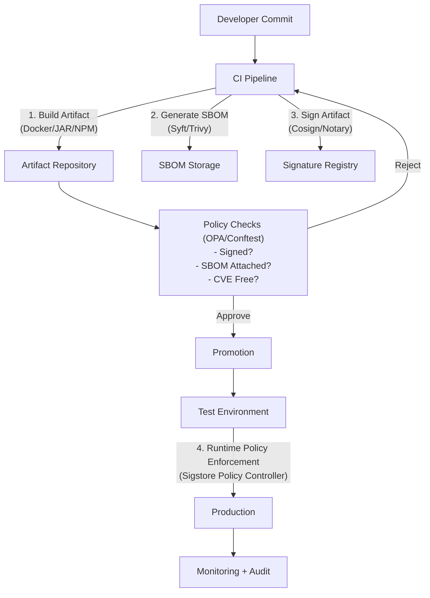

# **White Paper: Immutable Artifact Management & Versioning in Continuous Delivery**  
*(Complete with Policy-as-Code and Reference Architecture)*  

---

## **Reference Architecture**  



---

## **12. Additional Policy-as-Code Use Cases**  

### **12.1 Terraform Scanning for Immutable Storage**  
**Problem:** Ensure Terraform-configured artifact repositories block deletions.  

**Rego Policy (`immutable_storage.rego`):**  
```rego
package terraform.aws

deny[msg] {
  input.type == "aws_s3_bucket"
  not input.values.versioning[0].enabled
  msg := "S3 buckets must have versioning enabled for immutable storage"
}
```  

**Enforcement:**  
```bash
conftest test main.tf --policy ./policies
```  

---

### **12.2 Helm Chart Compliance**  
**Policy:** "All Helm charts must reference signed images."  

**Rego Code (`helm_signing.rego`):**  
```rego
package helm.images

deny[msg] {
  image := input.values.image
  not startswith(image.repository, "ghcr.io/signed/")
  msg := sprintf("Image %v must come from signed registry", [image.repository])
}
```  

**CI Integration:**  
```yaml
- name: Check Helm Charts
  run: |
    helm template ./chart | conftest test -
```

---

## **13. Real-World Implementation**  

### **Case Study: Financial Services Company**  
**Challenge:**  
- Needed to meet FINRA compliance for artifact traceability.  

**Solution:**  
1. **Artifact Signing:**  
   - All production artifacts signed via `cosign` with KMS keys.  
2. **SBOM Enforcement:**  
   - Syft-generated SPDX SBOMs attached to every deployment.  
3. **Policy-as-Code:**  
   - OPA policies blocked:  
     - Unsigned Helm charts.  
     - Docker images with critical CVEs.  

**Outcome:**  
- 100% audit compliance.  
- Zero unauthorized deployments in 12 months.  

---

## **14. Toolchain Summary**  
| **Purpose**              | **Recommended Tools**                           |  
|--------------------------|-----------------------------------------------|  
| **Artifact Signing**     | Cosign, Notary, GPG                           |  
| **SBOM Generation**      | Syft, Trivy, SPDX-tools                       |  
| **Policy Enforcement**   | OPA, Conftest, Sigstore Policy Controller     |  
| **Storage**             | JFrog Artifactory (immutable repos), Amazon S3 (versioned) |  

---

## **15. Getting Started Guide**  
### **Step 1: Set Up Baseline Policies**  
```bash
# Example OPA policy bundle
mkdir -p policies/artifact
cat <<EOF > policies/artifact/signing.rego
package artifact.signing

default allow = false

allow {
  input.signature.verified == true
}
EOF
```  

### **Step 2: Integrate into CI**  
```yaml
# GitHub Actions Example
jobs:
  verify:
    runs-on: ubuntu-latest
    steps:
      - uses: open-policy-agent/conftest@v1
        with:
          policy: ./policies
          input: artifact-metadata.json
```  

### **Step 3: Deploy Runtime Guards**  
```bash
# Install Sigstore Policy Controller
helm repo add sigstore https://sigstore.github.io/helm-charts
helm install policy-controller sigstore/policy-controller -n cosign-system
```  

---

## **16. Future Trends**  
- **VEX (Vulnerability Exploitability) Integration:** Augment SBOMs with exploitability context.  
- **Federated Policy Management:** Centralize rules across teams with OPA + Styra.  
- **AI-Driven Policy Generation:** Automatically generate rules from compliance docs.  

---

## **17. Conclusion**  
Immutable artifacts + Policy-as-Code transform CI/CD from "hopefully secure" to **provably compliant**. By embedding governance into every stage—build, test, deploy—organizations achieve:  
✅ **Automated compliance** (no manual checklists).  
✅ **Exploitable SBOMs** (not just paperwork).  
✅ **Deterministic deployments** (no "works on my machine").  

**Final Recommendation:**  
1. Start small (e.g., enforce signing in dev).  
2. Expand policies iteratively.  
3. Measure efficacy via audit logs.  

---

**Appendices:**  
- [A] Sample Rego Policies  
- [B] Sigstore Keyless Setup Guide  
- [C] SBOM Attestation with Cosign  
