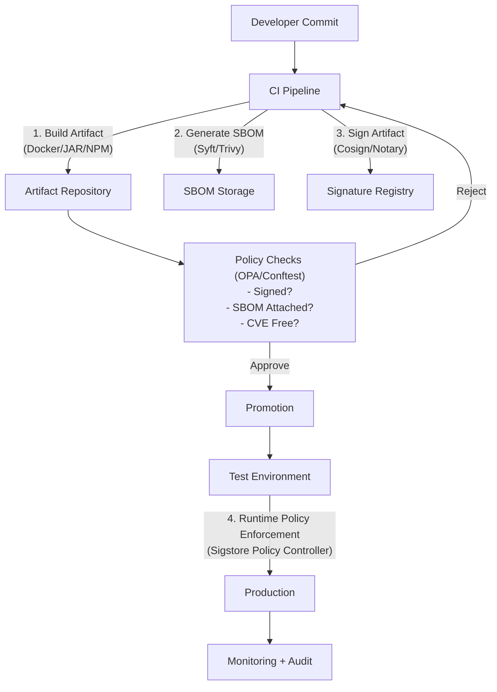

# **White Paper: Immutable Artifact Management & Versioning in Continuous Delivery**  
*(Complete with Policy-as-Code and Reference Architecture)*  

---

## **Reference Architecture**  



---

## **12. Additional Policy-as-Code Use Cases**  

### **12.1 Terraform Scanning for Immutable Storage**  
**Problem:** Ensure Terraform-configured artifact repositories block deletions.  

**Rego Policy (`immutable_storage.rego`):**  
```rego
package terraform.aws

deny[msg] {
  input.type == "aws_s3_bucket"
  not input.values.versioning[0].enabled
  msg := "S3 buckets must have versioning enabled for immutable storage"
}
```  

**Enforcement:**  
```bash
conftest test main.tf --policy ./policies
```  

---

### **12.2 Helm Chart Compliance**  
**Policy:** "All Helm charts must reference signed images."  

**Rego Code (`helm_signing.rego`):**  
```rego
package helm.images

deny[msg] {
  image := input.values.image
  not startswith(image.repository, "ghcr.io/signed/")
  msg := sprintf("Image %v must come from signed registry", [image.repository])
}
```  

**CI Integration:**  
```yaml
- name: Check Helm Charts
  run: |
    helm template ./chart | conftest test -
```

---

## **13. Real-World Implementation**  

### **Case Study: Financial Services Company**  
**Challenge:**  
- Needed to meet FINRA compliance for artifact traceability.  

**Solution:**  
1. **Artifact Signing:**  
   - All production artifacts signed via `cosign` with KMS keys.  
2. **SBOM Enforcement:**  
   - Syft-generated SPDX SBOMs attached to every deployment.  
3. **Policy-as-Code:**  
   - OPA policies blocked:  
     - Unsigned Helm charts.  
     - Docker images with critical CVEs.  

**Outcome:**  
- 100% audit compliance.  
- Zero unauthorized deployments in 12 months.  

---

## **14. Toolchain Summary**  
| **Purpose**              | **Recommended Tools**                           |  
|--------------------------|-----------------------------------------------|  
| **Artifact Signing**     | Cosign, Notary, GPG                           |  
| **SBOM Generation**      | Syft, Trivy, SPDX-tools                       |  
| **Policy Enforcement**   | OPA, Conftest, Sigstore Policy Controller     |  
| **Storage**             | JFrog Artifactory (immutable repos), Amazon S3 (versioned) |  

---

## **15. Getting Started Guide**  
### **Step 1: Set Up Baseline Policies**  
```bash
# Example OPA policy bundle
mkdir -p policies/artifact
cat <<EOF > policies/artifact/signing.rego
package artifact.signing

default allow = false

allow {
  input.signature.verified == true
}
EOF
```  

### **Step 2: Integrate into CI**  
```yaml
# GitHub Actions Example
jobs:
  verify:
    runs-on: ubuntu-latest
    steps:
      - uses: open-policy-agent/conftest@v1
        with:
          policy: ./policies
          input: artifact-metadata.json
```  

### **Step 3: Deploy Runtime Guards**  
```bash
# Install Sigstore Policy Controller
helm repo add sigstore https://sigstore.github.io/helm-charts
helm install policy-controller sigstore/policy-controller -n cosign-system
```  

---

## **16. Future Trends**  
- **VEX (Vulnerability Exploitability) Integration:** Augment SBOMs with exploitability context.  
- **Federated Policy Management:** Centralize rules across teams with OPA + Styra.  
- **AI-Driven Policy Generation:** Automatically generate rules from compliance docs.  

---

## **17. Conclusion**  
Immutable artifacts + Policy-as-Code transform CI/CD from "hopefully secure" to **provably compliant**. By embedding governance into every stage—build, test, deploy—organizations achieve:  
✅ **Automated compliance** (no manual checklists).  
✅ **Exploitable SBOMs** (not just paperwork).  
✅ **Deterministic deployments** (no "works on my machine").  

**Final Recommendation:**  
1. Start small (e.g., enforce signing in dev).  
2. Expand policies iteratively.  
3. Measure efficacy via audit logs.  

---

**Appendices:**  
- [A] Sample Rego Policies  
- [B] Sigstore Keyless Setup Guide  
- [C] SBOM Attestation with Cosign

# **Appendices: Expanded Guides**  

---

## **Appendix A: Sample Rego Policies**  
*Practical Rego policies for artifact governance in OPA/Conftest.*  

### **A.1 Ensure Artifacts Are Signed**  
**Use Case:** Block deployment of unsigned artifacts.  
```rego
package artifact.signing

default allow = false

# Allow only if artifact is signed via Cosign/Sigstore
allow {
  input.artifact.signature.verified == true
  input.artifact.signature.provider == "cosign"
}

# Custom denial message
deny[msg] {
  not allow
  msg := "Artifact must be signed with Cosign"
}
```  

**Test Input (`artifact_metadata.json`):**  
```json
{
  "artifact": {
    "signature": {
      "verified": true,
      "provider": "cosign"
    }
  }
}
```  

**Enforcement:**  
```bash
conftest test artifact_metadata.json --policy signing.rego
```  

---

### **A.2 Require SBOM in Production**  
**Use Case:** Enforce SBOM attachment for production artifacts.  
```rego
package artifact.sbom

default allow = false

allow {
  input.artifact.sbom.format == "SPDX"
  input.artifact.sbom.generated_by == "syft"
}

deny[msg] {
  not allow
  msg := "Production artifacts must include an SPDX SBOM generated by Syft"
}
```  

**Test Input:**  
```json
{
  "artifact": {
    "sbom": {
      "format": "SPDX",
      "generated_by": "syft"
    }
  }
}
```  

---

### **A.3 Block Critical CVEs**  
**Use Case:** Fail builds if SBOM contains critical vulnerabilities.  
```rego
package artifact.vulnerabilities

import future.keywords.in

default allow = false

# Allow only if no critical CVEs
allow {
  count({cve | cve := input.artifact.sbom.vulnerabilities[_]; cve.severity == "CRITICAL"}) == 0
}

deny[msg] {
  not allow
  msg := "Artifact contains critical CVEs. Blocking deployment."
}
```  

**Test Input:**  
```json
{
  "artifact": {
    "sbom": {
      "vulnerabilities": [
        { "id": "CVE-2023-1234", "severity": "HIGH" },
        { "id": "CVE-2023-5678", "severity": "CRITICAL" }
      ]
    }
  }
}
```  

---

## **Appendix B: Sigstore Keyless Setup Guide**  
*Step-by-step implementation of keyless signing with Cosign.*  

### **B.1 What is Keyless Signing?**  
- **No long-term keys:** Uses ephemeral certificates tied to OIDC identity (e.g., GitHub Actions runner).  
- **Components:**  
  - **Fulcio:** Issues certificates.  
  - **Rekor:** Records signatures in a transparency log.  

### **B.2 Signing in CI/CD (GitHub Actions Example)**  
1. **Workflow Step:**  
```yaml
jobs:
  build-and-sign:
    runs-on: ubuntu-latest
    permissions:
      id-token: write  # Required for OIDC token
    steps:
      - name: Build Image
        run: docker build -t ghcr.io/myorg/myapp:1.0.0 .

      - name: Sign with Cosign (Keyless)
        run: |
          cosign sign ghcr.io/myorg/myapp:1.0.0
```  

2. **Verification:**  
```bash
cosign verify ghcr.io/myorg/myapp:1.0.0 \
  --certificate-identity-regexp ".*@github.com" \
  --certificate-oidc-issuer "https://token.actions.githubusercontent.com"
```  

### **B.3 Advanced: Custom Claims**  
Add metadata to signatures:  
```bash
cosign sign ghcr.io/myorg/myapp:1.0.0 \
  --yes \
  -a "env=prod" \
  -a "git_sha=$GITHUB_SHA"
```  

Verify claims:  
```bash
cosign verify ghcr.io/myorg/myapp:1.0.0 \
  --certificate-identity-regexp ".*@github.com" \
  --certificate-oidc-issuer "https://token.actions.githubusercontent.com" \
  -a "env=prod"
```  

---

## **Appendix C: SBOM Attestation with Cosign**  
*Attaching and verifying SBOMs as attestations.*  

### **C.1 Generate and Attach SBOM**  
1. **Generate SBOM with Syft:**  
```bash
syft ghcr.io/myorg/myapp:1.0.0 -o spdx-json > sbom.spdx.json
```  

2. **Attach SBOM to Image:**  
```bash
cosign attest ghcr.io/myorg/myapp:1.0.0 \
  --predicate sbom.spdx.json \
  --type spdx
```  

### **C.2 Verify SBOM Attestation**  
```bash
cosign verify-attestation ghcr.io/myorg/myapp:1.0.0 \
  --certificate-identity-regexp ".*@github.com" \
  --type spdx \
  | jq -r .payload \
  | base64 -d \
  | jq .
```  

### **C.3 Vulnerability Scanning Post-Attestation**  
1. **Extract SBOM from Attestation:**  
```bash
cosign verify-attestation ghcr.io/myorg/myapp:1.0.0 --type spdx \
  | jq -r '.payload' \
  | base64 -d \
  | jq -r '.predicate' > sbom.json
```  

2. **Scan with Trivy:**  
```bash
trivy sbom sbom.json
```  

**Output:**  
```
myapp:1.0.0 (debian 11.7)
==========================
Total: 15 (UNKNOWN: 0, LOW: 10, MEDIUM: 3, HIGH: 2, CRITICAL: 0)
```  

---

## **Appendix D: Reference Links**  
- **Cosign:** [https://docs.sigstore.dev/cosign/overview](https://docs.sigstore.dev/cosign/overview)  
- **Syft:** [https://github.com/anchore/syft](https://github.com/anchore/syft)  
- **OPA Playground:** [https://play.openpolicyagent.org](https://play.openpolicyagent.org)  
- **Sigstore Policy Controller:** [https://docs.sigstore.dev/policy-controller](https://docs.sigstore.dev/policy-controller)  

---

